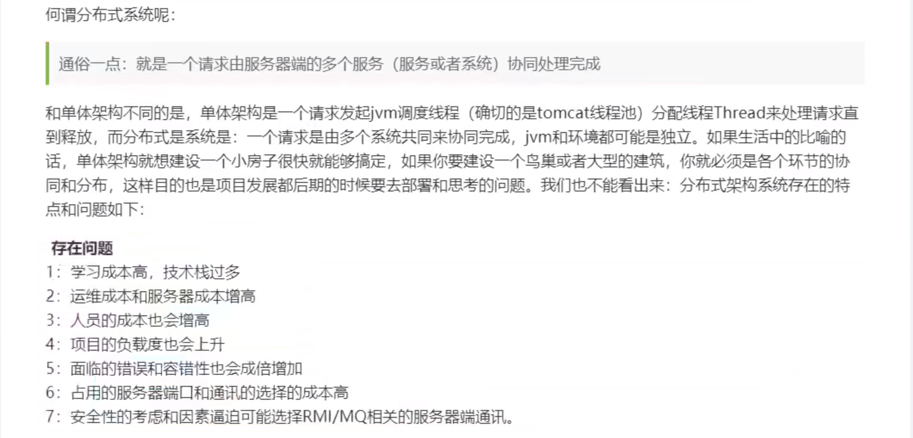
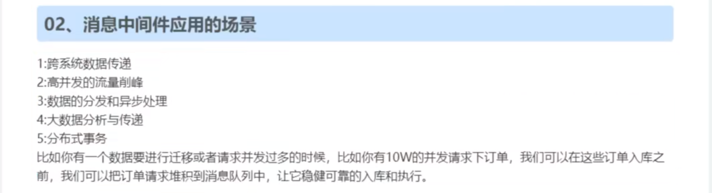
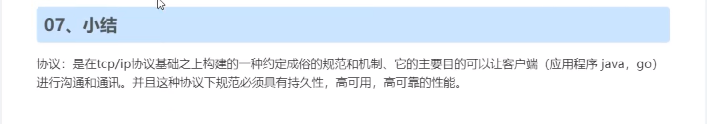
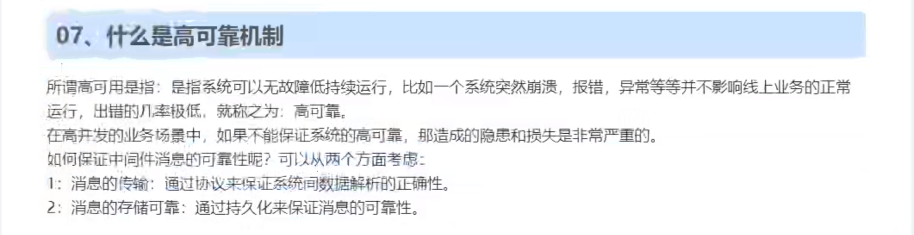

#  目录

[TOC]

# 课程地址

视频：

https://www.bilibili.com/video/BV1dX4y1V73G?p=1

资源：

https://www.kuangstudy.com/course/detail/1323452886432944129

# 课程安排

- RabbitMQ-01、什么是中间件
- RabbitMQ-02、聊聊中间件技术及单体和分布式架构
- RabbitMQ-03、基于消息中间件的分布式系统的架构
- RabbitMQ-04、消息队列协议
- RabbitMQ-05、消息队列的持久化
- RabbitMQ-06、消息的分发策略
- RabbitMQ-07、消息队列高可用和高可靠
- RabbitMQ-08、入门及安装
- RabbitMQ-09、Web管理界面及授权操作
- RabbitMQ-10、Docker安装RabbitMQ
- RabbitMQ-11、角色分类
- RabbitMQ-12、快速入门案例
- RabbitMQ-13、AMQP讲解
- RabbitMQ-14、RabbitMQ的组件和架构
- RabbitMQ-15、简单模式理解
- RabbitMQ-16、Fanout模式理解
- RabbitMQ-17、Direct模式理解
- RabbitMQ-18、Topic模式理解
- RabbitMQ-19、Headers模式理解
- RabbitMQ-20、Fanout模式入门案例
- RabbitMQ-21、Direct模式入门案例
- RabbitMQ-22、Topic模式入门案例
- RabbitMQ-23、完整的声明创建方式
- RabbitMQ-24、Work轮询模式讲解
- RabbitMQ-25、Work公平分发讲解
- RabbitMQ-26、MQ的使用场景
- RabbitMQ-27、整合Springboot-生产者-Fanout模式
- RabbitMQ-28、整合Springboot-消费者-Fanout模式
- RabbitMQ-29、整合Springboot-Direct模式
- RabbitMQ-30、整合Springboot-Topic模式
- RabbitMQ-31、高级-ttl队列过期时间
- RabbitMQ-32、高级-ttl消息过期时间
- RabbitMQ-33、高级-死信队列
- RabbitMQ-34、内存磁盘的监控
- RabbitMQ-35、集群搭建
- RabbitMQ-36、集群web界面管理调试
- RabbitMQ-37、高级-分布式事务概述
- RabbitMQ-38、高级-分布式事务案例
- RabbitMQ-39、高级-分布式事务-可靠生产和推送确认
- RabbitMQ-40、高级-分布式事务-可靠消费
- RabbitMQ-41、高级-分布式事务-可靠消费重试机制
- RabbitMQ-42、高级-分布式事务-可靠消费死信队列
- RabbitMQ-43、高级-分布式事务总结
- RabbitMQ-44、小结以及展望

# 什么是中间件

# 聊聊中间件技术及单体和分布式架构

# 基于消息中间件的分布式系统的架构

10w并发量

# 消息队列协议

什么是协议

# 消息队列的持久化

 

# 消息的分发策略

# 消息队列高可用和高可靠

不存在消息副本

存在消息副本，单写多读

> 解释：和上面的区别不大，但是 他的写入可以往任意节点去写入

> 小公司一般不会使用这种模式，成本比较大，至少需要6台服务器？

反正终归三局话：

- 要么消息共享
- 要么消息同步
- 要么元数据共享

# 入门及安装

